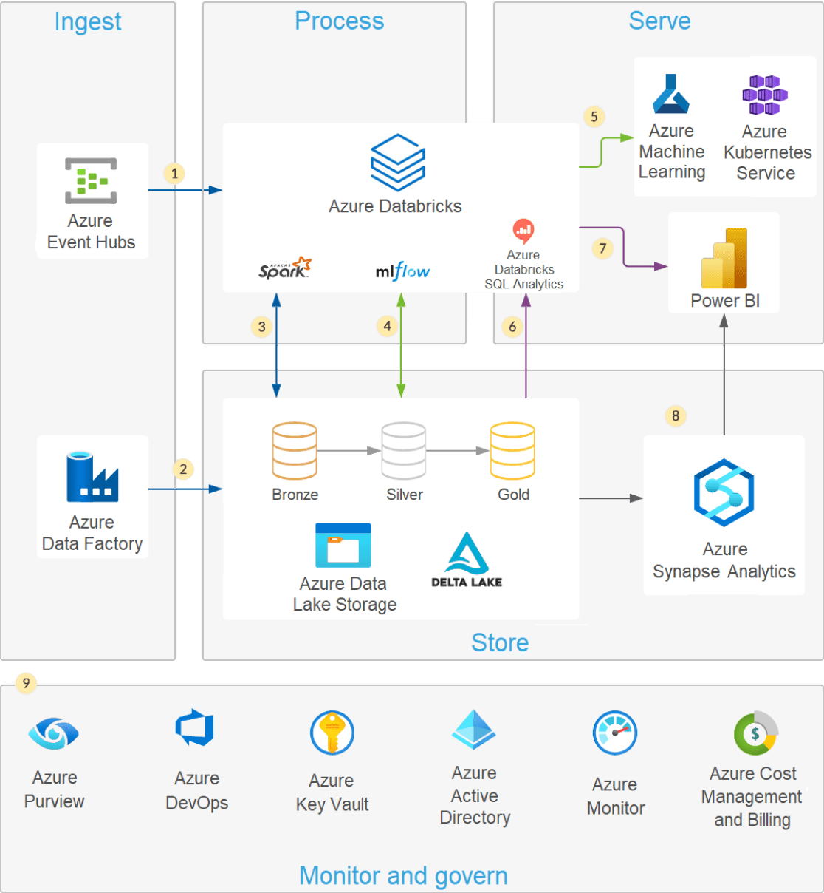

# azure-dlake
Data Plataform built on Azure provider.

## Architecture
Below we have a big picture about data platform. 
In this case we use a Delta Lake where backbone services deployed on azure and our processing data engine is a databricks data platform.

## Modules

- data_storage: Account storage services.
- data_de_adb : The data engineer's azure databricks services.
- data_de_adf : Data engineer's azure data factory.
- data_ds_labs: Data science's machine learning workspace.
- data_sre_backbone : Scope, groups and RBAC.

## Roadmap

| Feature    | Description                                 | Status |
| ---------- | ------------------------------------------- | ------ |
| Services   | Infra to build a data plataform             | 0      |
| Operations | Operations to execute routines on plataform | 0      |
| DataOps    | CICD to deploy pipelines on databricks      | 0      |
| MLOps      | CICD to deploy machine learning models      | 0      |

----

## Deploy

